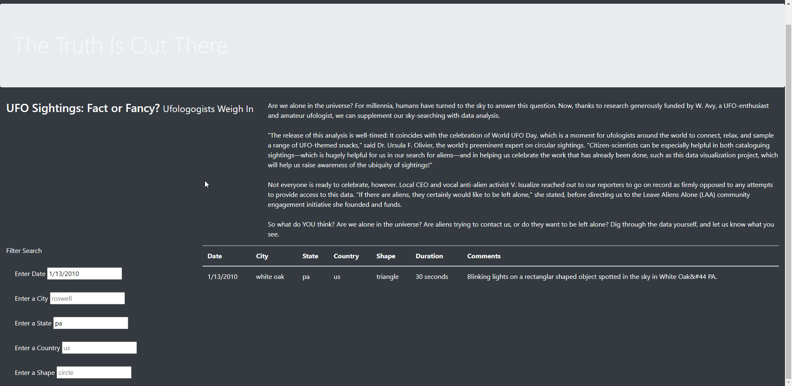

# UFOs

## Click to see HTML and JS files: 
https://github.com/dsaulsb1/UFOs/blob/6f9aaa9c29b380985c0c63915716ad9bc5a03db7/index.html
https://github.com/dsaulsb1/UFOs/blob/6f9aaa9c29b380985c0c63915716ad9bc5a03db7/static/js/app.js

## Analysis Overview

The purpose of this analysis was to create a webpage with a filterable dynamic table that displays the results of UFO sightings. Our 
first table was only able to filter by date, but the purpose of this challenge was to add additional filters, including city, state,
and country.

## Results

Please see image below:

In order to use the new webpage, first we must filter the data. The website will iniitially have every UFO sighting listed. As can be 
seen from the screenshot, adding in a date and state has filtered the list down to just one sighting. This will be fantastic in helping
Dana to organize her information.

## Summary

The major drawback from this design is the inability to select a range of dates. I recommend adjusting the code to enable the input of a specific 
range of dates. Another drawback from the design is the display of the website relative to the medium in which it is being viewed. The entire page 
can't be magnified if using a mobile device. As many people only use their mobile device rather than a computer, this would be a welcome change.
